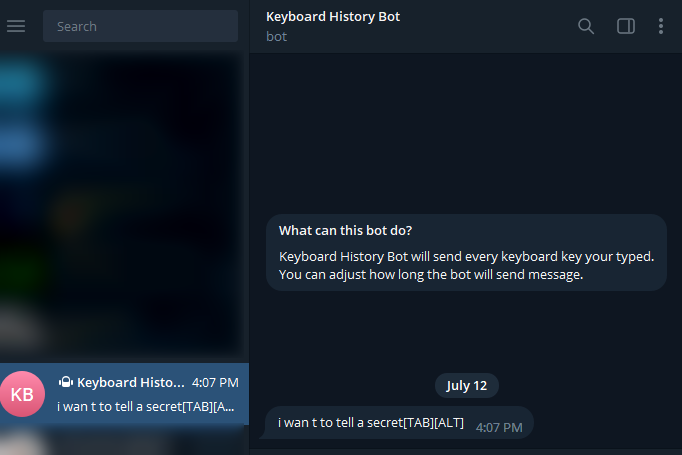

# Keyboard History


Keyboard History is a keylogger program that record every keystrokes your typed and save them as a file or send it to you directly.

Keyboard History have two type method :

1. Telegram : Send the log through Keyboard History Telegram Bot.
2. File : Save the log as file.txt

This program can work on Windows and Linux.

Still in development:)
(new method : Gmail, Whatsapp, Discord)

## Installation

* Download this repo on your computer:

```
git clone https://github.com/Lyft0/keyboard-history.git
```

* Install required Python library using command:

```
pip3 install -r requirements.txt
```

## How to run it?

* You need to configure how long the logs will be recorded in **main.py** file, specifically on line 4:

``` python
LOG_EVERY = 60 # Set interval time log (second)
```

* Run the program using command:

```
python3 main.py
```

* Keep the program running to record every keystrokes your typed.


## How to set the method?

### + Telegram

1. Change the method to **telegram** in **main.py** file, specifically on line 5:

``` python
METHOD = "telegram"
```

2. Open your Telegram Account and get your ChatID. You can get it with https://t.me/getmyid\_bot.
3. Copy and paste your Telegram ChatID to **method.py** file, specifically on line 7:

``` python
CHAT_ID = "YOUR CHAT_ID"
```

4. Run the program.
5. Keyboard History Bot will send the logs while the program running.


### + File

1. Change the method to **file** in **main.py** file, specifically on line 5:

``` python
METHOD = "file"
```

2. Run the program.
3. All log files will be stored on **log\_file** folder.

## Still in development:)

Feel free to contribute to fix any problems, or to submit an issue!
Please note, this repo is for educational purposes only..